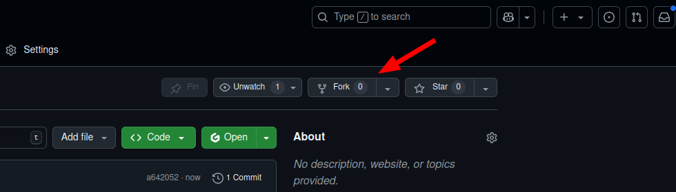
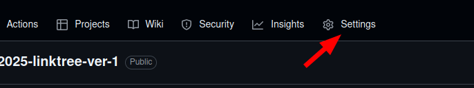
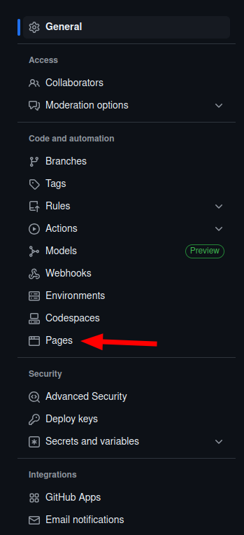

# Simple Linktree Version 1
## About
There are many that find linktrees to be useful and sufficient to them. But if 
you are just about to open your own small business, you may be frustrated at 
the lack of customisation for your linktree. 

This simple code should help you to get started on customising your own linktree at no to low-cost.

## Caveats
You will need to learn some simple HTML, CSS, very little JavaScript and understanding of Bootstrap. 

## How to use
You will need a GitHub account. Find the the `fork` button somewhere on the top right. This will create a copy of this code to your account. 

|  |
| - |

From there you can either download a zip file or clone the repository into your machine.

|  |
| - |

Use any code editor that you are comfortable with (that supports HTML/CSS/JS editing).

When you are done editing, either upload the files or push the code via GitHub. 

You will need to deploy the project in GitHub for it to show up.

## How to deploy in GitHub
1. In the repository (GitHub calls project folders repository), find `Settings`. 

||
| - |

2. Once in the settings page, look on the left panel and find `Pages`. Click on it.

||
| - |

3. In `Pages` look for `Build and deployment` --> `Branch`. Click on the dropdown and select `Master` or `Main`. Mine shows `Master` as I created my account before GitHub changed the name from `Master` to `Main`. Click on `Save` after you have selected `Master` or `Main`.

|  |
| - |

|  |
| - |

4. GitHub will begin compiling your code to deploy.You can see this under actions. The yellow dot will spin about and turn green when it's done compiling and deploying. Click on the `pages and deployment`.

||
| - |

5. When everything is green, you can click on this link to access your deployed page.

||
| - |

## Additional Suggestions
If you don't wish to share such a long URL, you can try a URL shortener, buy a domain and implement it 
in GitHub or generate a QR code to share around!